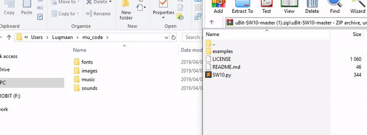
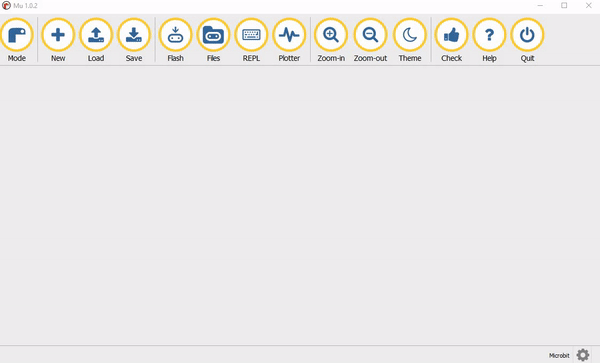

 
 
 

# uBit-SW10
SW10 uPython library for MicroBit

## Getting Started

1. Download and install [Mu](https://codewith.mu/en/download) Python Development Environment for beginners.
2. Once Mu is installed, run it and select BBC micro:bit.
3. Navigate to the mu_code root directory on your machine and copy and paste (do not cut) the *SW10.py* file into it. See [Mu and micro:bit](https://codewith.mu/en/tutorials/1.0/microbit) for more information.

  

4. Transfer *SW10.py* to the MicroBit and load *main.py* from the Mu Editor

  

